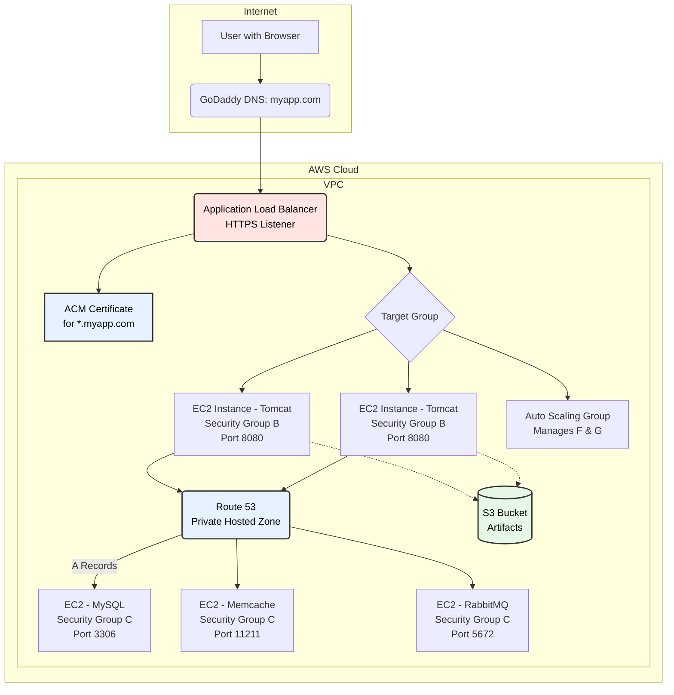

# vProfile Application - AWS Cloud Migration

## Project Overview
This project documents the migration of the vProfile application from an on-premises infrastructure to AWS Cloud. The application is a multi-tier web application built with Java (Spring framework) that demonstrates a typical enterprise architecture.

## Architecture Diagram



## Table of Contents
- [Project Overview](#project-overview)
- [Architecture Diagram](#architecture-diagram)
- [Original On-Premises Stack](#original-on-premises-stack)
- [AWS Services Used](#aws-services-used)
- [Architecture Components](#architecture-components)
- [Security Implementation](#security-implementation)
- [Prerequisites](#prerequisites)
- [Deployment Steps](#deployment-steps)
- [Configuration](#configuration)
- [Testing](#testing)
- [Troubleshooting](#troubleshooting)
- [Contributing](#contributing)
- [License](#license)

## Original On-Premises Stack
The application originally ran on virtual machines with the following services:
- **Web Server:** Nginx (Reverse Proxy)
- **Application Server:** Apache Tomcat
- **Backend Services:**
  - MySQL (Database)
  - Memcache (Caching)
  - RabbitMQ (Message Queue)

## AWS Services Used
| Service | Purpose |
|---------|---------|
| **Amazon Route 53** | DNS management & Private Hosted Zone |
| **AWS Certificate Manager (ACM)** | SSL/TLS certificate management |
| **Application Load Balancer (ALB)** | Traffic distribution & SSL termination |
| **EC2 Auto Scaling Group** | Tomcat instance management |
| **EC2 Instances** | Hosting Tomcat, MySQL, Memcache, RabbitMQ |
| **Security Groups** | Network security & access control |
| **Amazon S3** | Artifact storage |

## Architecture Components

### 1. DNS and Certificate Management
- **GoDaddy DNS:** Points domain to ALB endpoint
- **Route 53:** Manages private DNS for internal service discovery
- **ACM:** Provides SSL certificate for HTTPS encryption

### 2. Load Balancing Layer
- Application Load Balancer handles all incoming HTTPS traffic
- SSL termination at load balancer level
- Routes traffic to Tomcat instances on port 8080

### 3. Application Layer
- Auto Scaling group manages Tomcat EC2 instances
- Scales based on load (CPU/Memory metrics)
- Instances only accessible from load balancer

### 4. Backend Services Layer
- MySQL (Database)
- Memcache (Caching)
- RabbitMQ (Message Queue)
- Accessed via private DNS names through Route 53

## Security Implementation

### Security Groups Configuration
| Security Group | Inbound Rules | Source |
|----------------|---------------|--------|
| **ALB SG** | HTTPS (443) | Internet (0.0.0.0/0) |
| **Tomcat SG** | HTTP (8080) | ALB Security Group |
| **Backend SG** | MySQL (3306), Memcache (11211), RabbitMQ (5672) | Tomcat Security Group |

### Network Security
- Multi-tier security architecture
- Principle of least privilege applied
- Private subnets for application and database tiers
- Public subnets only for load balancer

## Prerequisites

### AWS Account Setup
- [ ] AWS account with administrative access
- [ ] IAM user with appropriate permissions
- [ ] AWS CLI configured locally
- [ ] Key pair for EC2 access

### Domain and Certificate
- [ ] Domain name registered (GoDaddy or other registrar)
- [ ] SSL certificate requested in ACM

### Local Tools
```bash
# Required installations
- AWS CLI v2
- Git
- VS Code with extensions:
  - Markdown Preview Mermaid Support
  - AWS Toolkit
  - YAML Support
```

## Deployment Steps

### Phase 1: Network Setup
```bash
# 1. Create VPC
aws ec2 create-vpc --cidr-block 10.0.0.0/16

# 2. Create public and private subnets
# 3. Set up Internet Gateway
# 4. Configure route tables
# 5. Create NAT Gateway for private subnets
```

### Phase 2: Security Groups
```bash
# Create security groups with the rules mentioned above
# Document each security group ID for reference
```

### Phase 3: Backend Services
```bash
# 1. Launch EC2 instances for MySQL, Memcache, RabbitMQ
# 2. Install and configure services
# 3. Update Route 53 private hosted zone with IPs
```

### Phase 4: Application Layer
```bash
# 1. Create launch template for Tomcat instances
# 2. Configure user-data script for artifact deployment
# 3. Create Auto Scaling group
# 4. Set up scaling policies
```

### Phase 5: Load Balancer
```bash
# 1. Create target group
# 2. Create Application Load Balancer
# 3. Configure listeners
# 4. Attach ACM certificate
```

### Phase 6: DNS Configuration
```bash
# 1. Update GoDaddy DNS with ALB endpoint
# 2. Create Route 53 private hosted zone
# 3. Add A records for backend services
```

## Configuration

### Tomcat User-Data Script
```bash
#!/bin/bash
# Update system
yum update -y

# Install Tomcat
yum install -y tomcat

# Download artifact from S3
aws s3 cp s3://your-bucket/vprofile.war /usr/share/tomcat/webapps/

# Start Tomcat
systemctl start tomcat
systemctl enable tomcat
```

### Application Properties
```properties
# Database configuration
db.host=mysql.internal.myapp.local
db.port=3306
db.name=vprofile

# Cache configuration
memcache.host=memcache.internal.myapp.local
memcache.port=11211

# Message queue configuration
rabbitmq.host=rabbitmq.internal.myapp.local
rabbitmq.port=5672
```

## Testing

### Validate Deployment
```bash
# 1. Check load balancer health
curl -I https://myapp.com

# 2. Verify SSL certificate
openssl s_client -connect myapp.com:443

# 3. Test backend connectivity
nslookup mysql.internal.myapp.local

# 4. Load test application
ab -n 1000 -c 10 https://myapp.com/
```

### Monitoring
- CloudWatch metrics for all services
- ALB access logs enabled
- VPC Flow Logs for network analysis


### Optimization Tips
- Use Reserved Instances for steady-state workloads
- Implement Auto Scaling for variable loads
- Use S3 lifecycle policies for old artifacts
- Monitor and right-size instances

## Troubleshooting

### Common Issues and Solutions

| Issue | Possible Cause | Solution |
|-------|---------------|----------|
| 504 Gateway Timeout | Load balancer timeout | Increase timeout settings |
| Connection refused | Security group rules | Verify security group configurations |
| DNS resolution failed | Private hosted zone not associated | Check VPC association |
| Auto Scaling not working | Incorrect metrics | Verify CloudWatch alarms |

### Debug Commands
```bash
# Check instance logs
ssh -i key.pem ec2-user@instance-ip
tail -f /var/log/cloud-init-output.log

# Verify security groups
aws ec2 describe-security-groups --group-ids sg-xxxxx

# Test DNS resolution
dig mysql.internal.myapp.local
```

## Contributing
Please read [CONTRIBUTING.md](CONTRIBUTING.md) for details on our code of conduct and the process for submitting pull requests.

## License
This project is licensed under the MIT License - see the [LICENSE.md](LICENSE.md) file for details.

## Acknowledgments
- Original vProfile application team hkhcoder
- AWS Documentation
- Cloud computing best practices

---
**Last Updated:** March 2026
**Version:** 1.0.0
**Author:** Your Name/Team


